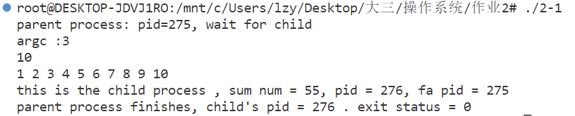
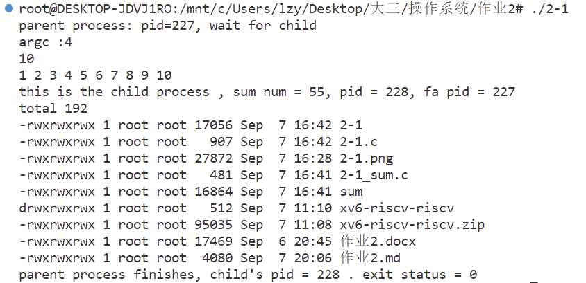
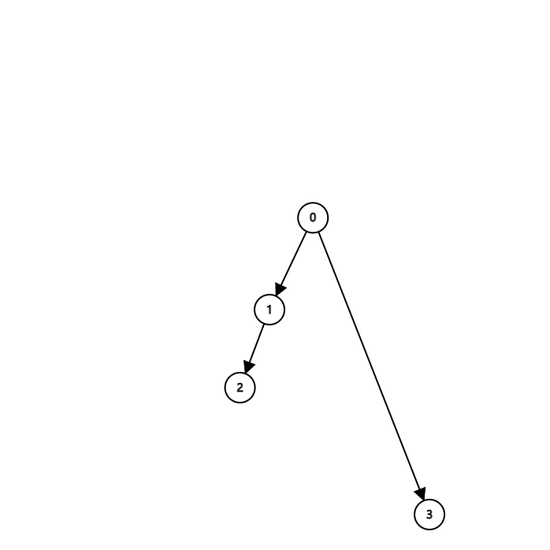
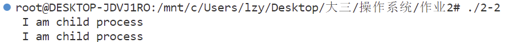
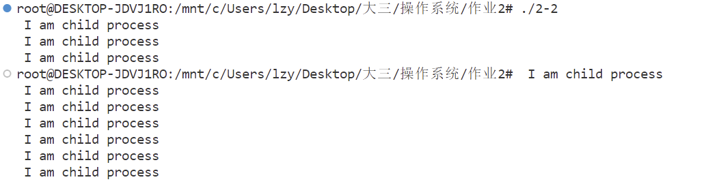

刘子扬 2020K8009929043


2.1 

fork、exec、wait等是进程操作的常用API，请调研了解这些API的使用方法。

（1）请写一个C程序，该程序首先创建一个1到10的整数数组，然后创建一个子进程，并让子进程对前述数组所有元素求和，并打印求和结果。等子进程完成求和后，父进程打印“parent process finishes”,再退出。

（2）在（1）所写的程序基础上，当子进程完成数组求和后，让其执行ls -l命令(注：该命令用于显示某个目录下文件和子目录的详细信息)，显示你运行程序所用操作系统的某个目录详情。例如，让子进程执行 ls -l /usr/bin目录，显示/usr/bin目录下的详情。父进程仍然需要等待子进程执行完后打印“parent process finishes”,再退出。

（3）请阅读XV6代码（https://pdos.csail.mit.edu/6.828/2021/xv6.html） ，找出XV6代码中对进程控制块（PCB）的定义代码，说明其所在的文件，以及当fork执行时，对PCB做了哪些操作？

1)

主进程程序设计如下：
```c
#include<unistd.h>
#include<sys/wait.h>
#include <sys/types.h>
#include<stdio.h>
#include<stdlib.h>
char sum[10];
static void testExecv() {
    char tot[1]={10};
    char *argv[] = {"sum",tot,sum,(char*)NULL};
    int result = execv("/mnt/c/Users/lzy/Desktop/大三/操作系统/作业2/sum", argv);
    if (result == -1) {
        perror("execl error");
    }
}
int main(){
    for(int i=0;i<10;++i)sum[i]=i+1;
    pid_t pid;
    pid = fork();
    int status,id;
    if(pid == -1){
        perror("fork error");
        exit(-1);
    }
    else if(pid==0){
        testExecv();
        exit(1);
    }
    else if(pid>0){
        printf("parent process: pid=%d, wait for child\n",getpid());
        pid = wait(&status);
        id = WEXITSTATUS(status); 
        printf("parent process finishes, child's pid = %d . exit status = %d\n",pid,id);
    } 
    return 0;  
}
```
利用execv函数调用的子进程代码如下：
```c
#include<unistd.h>
#include<stdio.h>
#include<stdlib.h>
int main(int argc,char **argv){
    printf("argc :%d\n",argc);
    argv++;
    int tot = (*argv)[0];
    printf("%d\n",tot);
    argv++;
    int ans=0;
    char * sum = *argv;
    for(int i=0;i<tot;++i){
        printf("%d ",sum[i]);
        ans+=sum[i];
    }
    puts("");
    printf("this is the child process , sum num = %d, pid = %d, fa pid = %d\n",ans,getpid(),getppid());
    return 0;
}
```
程序主要思想是利用fork()产生一个父进程一个子进程，随后利用execv()函数进行调用。经过调研，选择exec函数的规律是：函数名字里以exec为前缀，紧随其后的一些字符的含义是，l表示命令行参数列表、p表示PATH环境变量、v表示使用参数数组、e使用环境变量数组。

由于我考虑使用参数数组把1-10的整数传递过去，所以我选择了execv()。

除此之外，为了保证父亲进程在子进程结束之后打印相关内容，我使用了wait函数。wait函数可以阻塞父进程的运行，直到子进程运行完毕，最后代码运行的效果如下：
    

2)

第二问在第一问的基础上只需添加一小段代码，第一是在主程序输入的argv中添加ls-l指令：
```c
static void testExecv() {
    char tot[1]={10};
    char *cmdstring="ls -l";
    char *argv[] = {"sum",tot,sum,cmdstring,(char*)NULL};
    int result = execv("/mnt/c/Users/lzy/Desktop/大三/操作系统/作业2/sum", argv);
    if (result == -1) {
        perror("execl error");
    }
}
```
随后在子进程时将这个指令执行出来即可：
```c
int main(int argc,char **argv){
    printf("argc :%d\n",argc);
    argv++;
    int tot = (*argv)[0];
    printf("%d\n",tot);
    argv++;
    int ans=0;
    char * sum = *argv;
    for(int i=0;i<tot;++i){
        printf("%d ",sum[i]);
        ans+=sum[i];
    }
    puts("");
    printf("this is the child process , sum num = %d, pid = %d, fa pid = %d\n",ans,getpid(),getppid());
    argv++;
    system(*argv);
    return 0;
}
```
执行效果如下：


3)
经过调研，发现在xv6的proc.h和proc.c两个代码中包含了PCB的所有相关代码。其中proc.h中定义了进程控制模块：
```c
struct proc {
  struct spinlock lock;

  // p->lock must be held when using these:
  enum procstate state;        // Process state
  void *chan;                  // If non-zero, sleeping on chan
  int killed;                  // If non-zero, have been killed
  int xstate;                  // Exit status to be returned to parent's wait
  int pid;                     // Process ID

  // wait_lock must be held when using this:
  struct proc *parent;         // Parent process

  // these are private to the process, so p->lock need not be held.
  uint64 kstack;               // Virtual address of kernel stack
  uint64 sz;                   // Size of process memory (bytes)
  pagetable_t pagetable;       // User page table
  struct trapframe *trapframe; // data page for trampoline.S
  struct context context;      // swtch() here to run process
  struct file *ofile[NOFILE];  // Open files
  struct inode *cwd;           // Current directory
  char name[16];               // Process name (debugging)
};
```
其中，与操作系统进程管理有关的信息是：内核栈kstack，进程状态state，进程id（pid），父进程parent，中断帧trapframe，进程上下文context和与sleep/kill有关的chan和killed变量。

其余还包含一些程序运行必须的环境信息包括目录cwd，打开的文件ofile，和使用的页面表pagetable（存储互斥锁等必要信息）。


fork()运行的时候，首先会调用allocproc()函数来获得一个进程控制块，随后使用uvmcopy()函数赋值虚拟内存结构，并且为了保证两个进程一模一样，还会拷贝中断帧（*(np->trapframe) = *(p->trapframe)。为了保证返回值为0，还设置了a0寄存器为0，然后将父进程所有打开的文件描述符全部和目录拷贝给子进程。最后，fork()函数拷贝了父进程名字，并设置了子进程的父进程号，并设置状态为RUNNABLE，最后返回给父进程进程号。
```c
int
fork(void)
{
  int i, pid;
  struct proc *np;
  struct proc *p = myproc();

  // Allocate process.
  if((np = allocproc()) == 0){
    return -1;
  }

  // Copy user memory from parent to child.
  if(uvmcopy(p->pagetable, np->pagetable, p->sz) < 0){
    freeproc(np);
    release(&np->lock);
    return -1;
  }
  np->sz = p->sz;

  // copy saved user registers.
  *(np->trapframe) = *(p->trapframe);

  // Cause fork to return 0 in the child.
  np->trapframe->a0 = 0;

  // increment reference counts on open file descriptors.
  for(i = 0; i < NOFILE; i++)
    if(p->ofile[i])
      np->ofile[i] = filedup(p->ofile[i]);
  np->cwd = idup(p->cwd);

  safestrcpy(np->name, p->name, sizeof(p->name));

  pid = np->pid;

  release(&np->lock);

  acquire(&wait_lock);
  np->parent = p;
  release(&wait_lock);

  acquire(&np->lock);
  np->state = RUNNABLE;
  release(&np->lock);

  return pid;
}

// Pass p's abandoned children to init.
// Caller must hold wait_lock.
void
reparent(struct proc *p)
{
  struct proc *pp;

  for(pp = proc; pp < &proc[NPROC]; pp++){
    if(pp->parent == p){
      pp->parent = initproc;
      wakeup(initproc);
    }
  }
}
```

2.2 请阅读以下程序代码，回答下列问题

（1）该程序一共会生成几个子进程？请你画出生成的进程之间的关系（即谁是父进程谁是子进程），并对进程关系进行适当说明。

（2）如果生成的子进程数量和宏定义LOOP不符，在不改变for循环的前提下，你能用少量代码修改，使该程序生成LOOP个子进程么？

提交内容
（1）	问题解答，关系图和说明等
（2）	修改后的代码，结果截图，对代码的说明等

```c
#include<unistd.h>
#include<stdio.h>
#include<string.h>
#define LOOP 2
int main(int argc,char *argv[])
{
   pid_t pid;
   int loop;

   for(loop=0;loop<LOOP;loop++) {

      if((pid=fork()) < 0)
         fprintf(stderr, "fork failed\n");
      else if(pid == 0) {
         printf(" I am child process\n");
      }
      else {
         sleep(5);
      }
    }
    return 0;
}
```

1)
经过运行代码，发现实际上生成了3个子进程。这个程序的代码逻辑是这样的：最开始程序（记作进程0）运行loop=0，主程序执行fork()函数，fork()会拷贝当前程序的trapfram和内存中所有的数据，此时得到了一个子进程1，打印第一行I am child process。由于根据代码进程0会休眠5s，所以子进程1会先运行，loop=1，通过fork()再次生成一个子进程2，这个子进程打印第二行I am child process。随后进程0休眠结束，loop=1，执行fork()函数，得到子进程3，打印最后一行I am child process。关系图如下：


2)
一个比较直观的改动方法是：将父进程中sleep改为break，这样就使得创建了子进程后父进程就结束了，那么创建LOOP个子进程，就会打印LOOP个I am child process。
```c
#include<unistd.h>
#include<stdio.h>
#include<string.h>
#define LOOP 2
int main(int argc,char *argv[])
{
   pid_t pid;
   int loop;
   for(loop=0;loop<LOOP;loop++) {
      if((pid=fork()) < 0)
         fprintf(stderr, "fork failed\n");
      else if(pid == 0) {
         printf(" I am child process\n");
      }
      else {
         //  sleep(5);
         break;
      }
    }
    return 0;
}
```
一下是效果展示：
当LOOP=2时

当LOOP=10时
