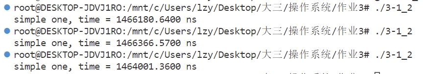
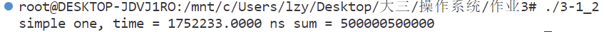
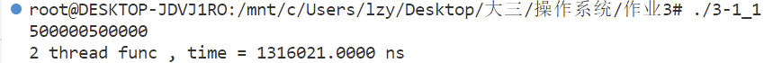
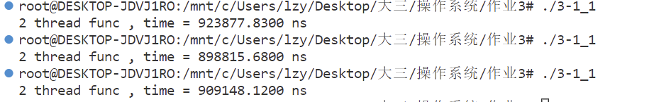
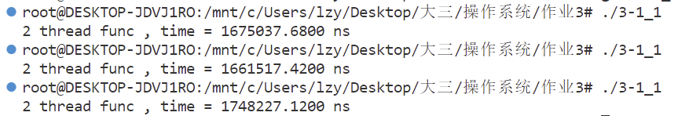
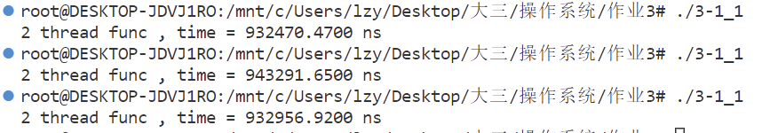
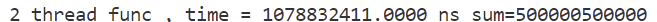
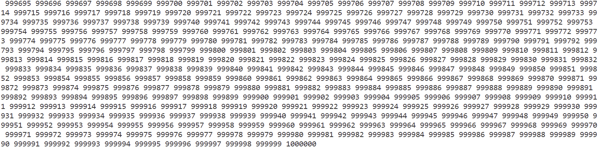

刘子扬 2020K8009929043 作业3

3.1 pthread函数库可以用来在Linux上创建线程，请调研了解pthread_create，pthread_join，pthread_exit等API的使用方法，然后完成以下任务：

（1）写一个C程序，首先创建一个值为1到100万的整数数组，然后对这100万个数求和。请打印最终结果，统计求和操作的耗时并打印。（注：可以使用作业1中用到的gettimeofday和clock_gettime函数测量耗时）；

（2）在（1）所写程序基础上，在创建完1到100万的整数数组后，使用pthread函数库创建N个线程（N可以自行决定, 且N>1），由这N个线程完成100万个数的求和，并打印最终结果。请统计N个线程完成求和所消耗的总时间并打印。和（1）的耗费时间相比，你能否解释（2）的耗时结果？（注意：可以多运行几次看测量结果）

（3）在（2）所写程序基础上，增加绑核操作，将所创建线程和某个CPU核绑定后运行，并打印最终结果，以及统计N个线程完成求和所消耗的总时间并打印。和（1）、（2）的耗费时间相比，你能否解释（3）的耗时结果？（注意：可以多运行几次看测量结果）

1) 
    C程序设计如下：
```c
#define __USE_GNU  
#include <sched.h>
#include <pthread.h>
#include <stdio.h>
#include <stdlib.h>
#include <unistd.h>
#include <time.h>

#define N 1000000
#define numworker 2
int MAXT=100;
int arr[N+10];
int main(){
   for(int i=1;i<=N;++i)arr[i]=i;
   struct timespec t1 = {0, 0}; 
   struct timespec t2 = {0, 0}; 
   clock_gettime(CLOCK_REALTIME, &t1);   
   while(MAXT--){
      long sum = 0;
      for(int i=1;i<=N;++i)sum+=i;
   }

   clock_gettime(CLOCK_REALTIME, &t2);
   double duration=(t2.tv_sec - t1.tv_sec)*1000000000 + (t2.tv_nsec - t1.tv_nsec);
   printf("simple one, time = %.4lf ns\n",duration/100);
   
   return 0;
}
```
程序运行效果图如下：

一百次运行平均用时1466180ns。
单次运行结果也是正确的：

2)
    改为使用多线程（2个线程）运行代码的如下：
```c
#define __USE_GNU  
#include <sched.h>
#include <pthread.h>
#include <stdio.h>
#include <stdlib.h>
#include <unistd.h>
#include <time.h>

#define N 1000000
#define numworker 2
int arg0[2] = {numworker,0};
int arg1[2] = {numworker,1};
int arr[N+10];
int MAXT = 100;
//线程执行的函数
void *worker(void *arg){
   int tot = N;
   int * argnow = arg;
   int mod = argnow[0];
   int res = argnow[1];
// cpu_set_t cpuset;   //CPU核的位图
//    CPU_ZERO(&cpuset);  //将位图清零
//    CPU_SET(res, &cpuset);  //设置位图第N位为1，表示与core N绑定。N从0开始计数
//    sched_setaffinity(0, sizeof(cpuset), &cpuset);  //将当前线程和cpuset位图中指定的核绑定运行

   long * ret = (long *) malloc(sizeof (long ));
   for(int i=res;i<=N;i+=mod){
      (*ret) += arr[i];
   }
   return ret;
}

int main(){
   for(int i=0;i<=N;++i)arr[i]=i;
   struct timespec t1 = {0, 0}; 
   struct timespec t2 = {0, 0}; 
   clock_gettime(CLOCK_REALTIME, &t1);   
   
   while(MAXT--){
      pthread_t id_0,id_1;
      int * ret0, *ret1;
      pthread_create(&id_0,NULL,worker,arg0);
      pthread_create(&id_1,NULL,worker,arg1);
      void * res0, *res1;

      pthread_join(id_0,&res0);  
      pthread_join(id_1,&res1);

      long sum = *(long *)res0 + *(long *)res1;      
   }

   clock_gettime(CLOCK_REALTIME, &t2);
   double duration=(t2.tv_sec - t1.tv_sec)*1000000000 + (t2.tv_nsec - t1.tv_nsec);
   printf("2 thread func , time = %.4lf ns\n",duration/100);

   
   return 0;
}

```
如果只运行一遍，发现结果是正确的：

同样是运行一百遍的平均时间和效果如下：

平均用时为909148ns。经过分析，我认为出现这个用时的主要原因是因为在执行一百万次循环时，由于可以用两个线程一个算偶数一个算奇数，所以实际上最费时间的for循环部分实际上每个线程只执行五十万次，所以总的来讲用时减少了快一半（但是由于系统调用等原因，所以还是比一半略多）。也就是下面这一小段代码所实现内容(mod的值即为线程数，在这里为2)：
```c
   for(int i=res;i<=N;i+=mod){
      (*ret) += arr[i];
   }
```

3)
    继续对代码进行如下修改：
```c
void *worker(void *arg){
   int tot = N;
   int * argnow = arg;
   int mod = argnow[0];
   int res = argnow[1];
cpu_set_t cpuset;   //CPU核的位图
   CPU_ZERO(&cpuset);  //将位图清零
   CPU_SET(1, &cpuset);  //设置位图第N位为1，表示与core N绑定。N从0开始计数
   sched_setaffinity(0, sizeof(cpuset), &cpuset);  //将当前线程和cpuset位图中指定的核绑定运行

   long * ret = (long *) malloc(sizeof (long ));
   for(int i=res;i<=N;i+=mod){
      (*ret) += arr[i];
   }
   return ret;
}
```
我首先将两个进程放在了一个核内，运行时间效果如下：

三次平均运行时间为：1675037ns，在启用了多线程后和不启用差不多快慢。我认为这个现象的主要原因是两个线程被绑定在了同一个核上，所以导致虽然开启了两个线程，但实际上还是需要等待一个线程运行结束才能开启下一个进程，再算上系统调用的时间，最后甚至比直接循环求和还略慢。
但是如果将两个进程放在两个核（core0和core1），那么运行结果如下：
```c
cpu_set_t cpuset;   //CPU核的位图
   CPU_ZERO(&cpuset);  //将位图清零
   CPU_SET(res, &cpuset);  //设置位图第N位为1，表示与core N绑定。N从0开始计数
   sched_setaffinity(0, sizeof(cpuset), &cpuset);  //将当前线程和cpuset位图中指定的核绑定运行
```

平均运行用时为932956ns，和不绑定核的速度差不多。考虑到由于是固定分配到core0和core1，相比由操作系统分配到两个核，如果遇到这两个核临时占用，那么有可能还会慢一些。

3.2 请调研了解pthread_create，pthread_join，pthread_exit等API的使用方法后，完成以下任务：

（1）写一个C程序，首先创建一个有100万个元素的整数型空数组，然后使用pthread创建N个线程（N可以自行决定, 且N>1），由这N个线程完成前述100万个元素数组的赋值(注意:赋值时第i个元素的值为i) 。最后由主进程对该数组的100万个元素求和,并打印结果,验证线程已写入数据。

代码设计如下：
```c
#define __USE_GNU  
#include <sched.h>
#include <pthread.h>
#include <stdio.h>
#include <stdlib.h>
#include <unistd.h>
#include <time.h>

#define N 1000000
#define numworker 2
int arg0[2] = {numworker,0};//numworker线程数，告知程序for循环运行的补偿0/1代表填偶数还是奇数
int arg1[2] = {numworker,1};//
int arr[N+10];
//线程执行的函数
void *worker(void *arg){
    int tot = N;
    int * argnow = arg;
    int mod = argnow[0];
    int res = argnow[1];
cpu_set_t cpuset;   //CPU核的位图
    CPU_ZERO(&cpuset);  //将位图清零
    CPU_SET(res, &cpuset);  //设置位图第N位为1，表示与core N绑定。N从0开始计数
    sched_setaffinity(0, sizeof(cpuset), &cpuset);  //将当前线程和cpuset位图中指定的核绑定运行

    for(int i=res;i<=N;i+=mod){
      arr[i]=i;
    }
}

int main(){
    struct timespec t1 = {0, 0}; 
    struct timespec t2 = {0, 0}; 
    clock_gettime(CLOCK_REALTIME, &t1);   
   
    pthread_t id_0,id_1;
    pthread_create(&id_0,NULL,worker,arg0);//id_0将所有偶数填满
    pthread_create(&id_1,NULL,worker,arg1);//id_1将所有奇数填满

    pthread_join(id_0,NULL);  
    pthread_join(id_1,NULL);//pthread_join是阻塞等待子线程执行完毕，所以使用此功能可以保证arr已经被写入完毕
    long long sum = 0;
    for(int i=1;i<=N;++i)sum+=arr[i];  

    clock_gettime(CLOCK_REALTIME, &t2);
    double duration=(t2.tv_sec - t1.tv_sec)*1000000000 + (t2.tv_nsec - t1.tv_nsec);
    printf("2 thread func , time = %.4lf ns sum=%lld\n",duration,sum);

    return 0;
}

```
效果是这样的：

如果再把arr数组打印出来，可以发现正确的写入了每个位置。

这个程序设计的思想是这样的，建立两个线程，同时把arr的奇数组和偶数组写入对应的值。然后利用pthread_join()函数阻塞的特性，只有当这两个线程运行完毕后，才会开始下一步运算。最终成功将这100万个数求和。