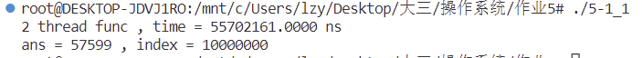
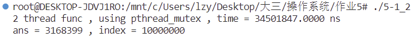
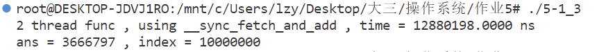
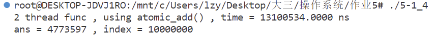
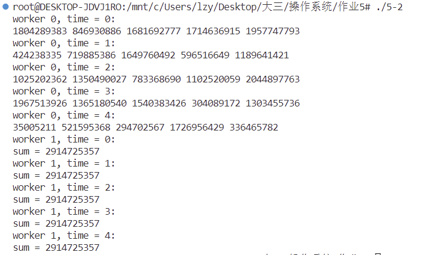
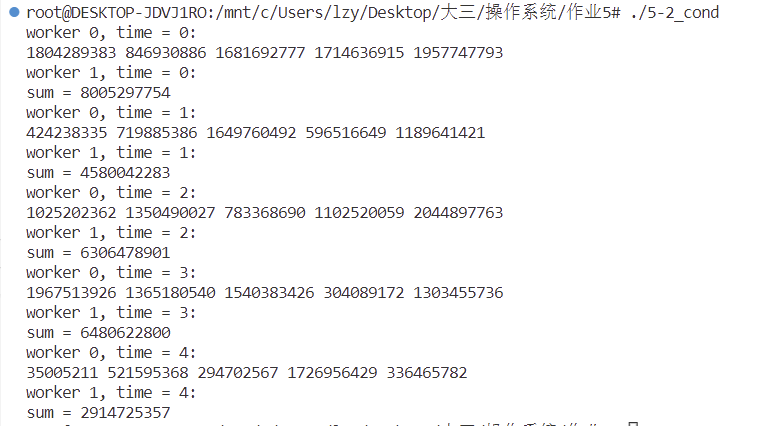

刘子扬 2020K8009929043 作业5

5.1 写一个两线程程序，两线程同时向一个数组分别写入1000万以内的奇数和偶数，写入过程中两个线程共用一个偏移量index，代码逻辑如下所示。写完后打印出数组相邻两个数的最大绝对差值。 
```
int MAX=10000000;
index = 0
//thread1 
for(i=0;i<MAX;i+=2) {
data[index] = i; //even ( i+1 for thread 2) 
index++;
}
//thread2 
for(i=0;i<MAX;i+=2) {
data[index] = i+1; //odd 
index++;
}
```
请分别按下列方法完成一个不会丢失数据的程序: 
1) 请用 Peterson 算法实现上述功能;
2) 请学习了解 pthread_mutex_lock/unlock()函数, 并实现上述功能;
3) 请学习了解 atomic_add()( __sync_fetch_and_add()for gcc 4.1+) 函数, 并实现上述功能。

提交:
1.	说明你所写程序中的临界区（注意：每次进入临界区之后，执行200次操作后离开临界区。）
2.	提供上述三种方法的源代码，运行结果截图(即，数组相邻两个数的最大绝对差值) 
3.	请找一个双核系统测试三种方法中完成数组写入时，各自所需的执行时间，不用提供计算绝对差值的时间。

### 1 使用 Peterson算法实现本功能：
Peterson算法值得注意的一点是turn是一个两个线程都要使用的变量，但是C语言并不保证多核缓存实时交换顺序，所以一定要定义turn为原子变量，或者在turn附近的地方添加mfence内联汇编的内存屏障强制把写缓冲区/高速缓存中的脏数据等写回主内存。

实现代码如下：
```c
#define __USE_GNU  
#include <sched.h>
#include <pthread.h>
#include <stdio.h>
#include <stdlib.h>
#include <unistd.h>
#include <time.h>
#include <stdatomic.h>
#define N 10000000
#define numworker 2
#define bool unsigned char
#define true  1
#define false 0
int data[N+10];
//线程执行的函数
atomic_int turn = -1;
int index_num = 0;
bool flag[numworker];
void *worker0(void *arg){
    // int i;
    for(int i=0;i<N;i+=2){
        if(i%400==0){
            flag[0]=true;
            turn = 1;
            while(flag[1] == true && turn == 1);
            //lock
        }
        data[index_num] = i;
        index_num = index_num + 1;
        if(i%400==398){
            flag[0]=false;//unlock
        }
    }
    return NULL;
}

void *worker1(void *arg){
    // int i;
    for(int i=0;i<N;i+=2){
        if(i%400==0){//lock
            flag[1]=true;
            turn = 0;
            while(flag[0] == true && turn == 0);
        }
        data[index_num] = i + 1;
        index_num = index_num + 1;
        if(i%400==398){
            flag[1]=false;
        }
    }
    return NULL;
}

int main(){
    
    pthread_t id_0, id_1;
    struct timespec t1 = {0, 0}; 
    struct timespec t2 = {0, 0}; 
    clock_gettime(CLOCK_REALTIME, &t1);   

    pthread_create(&id_0,NULL,worker0,NULL);
    pthread_create(&id_1,NULL,worker1,NULL);
    pthread_join(id_0,NULL);  
    pthread_join(id_1,NULL);

    clock_gettime(CLOCK_REALTIME, &t2);
    double duration=(t2.tv_sec - t1.tv_sec)*1000000000 + (t2.tv_nsec - t1.tv_nsec);
    printf("2 thread func , time = %.4lf ns\n",duration);
    long long ans = -1;
    for(int i=1;i<N;i++){
        long long temp = data[i]- data[i-1];
        temp = temp > 0 ? temp : -temp;
        ans  = ans < temp ? temp : ans;
    }
    printf("ans = %lld , index_num = %d\n",ans,index_num);
}
```
本代码的临界区为：
```c
        data[index] = i;
        index++;
```
和
```c
        data[index] = i + 1;
        index++;
```
由于两个线程需要同时向data内写入数据，且共用一个下标地址index，因此这块逻辑必须属于临界区，否则另外一个线程执行的index++会影响原本线程的index++写入的数据。运行效果如图：

### 2 使用 pthread_mutex_lock/unlock()函数实现本功能：
代码如下：
```c
#define __USE_GNU  
#include <sched.h>
#include <pthread.h>
#include <stdio.h>
#include <stdlib.h>
#include <unistd.h>
#include <time.h>
#define N 10000000
#define numworker 2
int data[N+10];
pthread_mutex_t mutex = PTHREAD_MUTEX_INITIALIZER;/*初始化互斥锁*/
int index = 0;

void *worker0(void *arg){
    int i;
    for(i=0;i<N;i+=2){
        if(i%400==0){
            //lock
            pthread_mutex_lock(&mutex);
        }
        data[index] = i;
        index++;
        if(i%400==398){
            pthread_mutex_unlock(&mutex);
        }
    }
}

void *worker1(void *arg){
    int i;
    for(i=0;i<N;i+=2){
        if(i%400==0){//lock
            pthread_mutex_lock(&mutex);
        }
        data[index] = i + 1;
        index++;
        if(i%400==398){
            pthread_mutex_unlock(&mutex);            
        }
    }
}
int main(){
    pthread_t id_0, id_1;
    struct timespec t1 = {0, 0}; 
    struct timespec t2 = {0, 0}; 
    clock_gettime(CLOCK_REALTIME, &t1);   

    pthread_create(&id_0,NULL,worker0,NULL);
    pthread_create(&id_1,NULL,worker1,NULL);
    pthread_join(id_0,NULL);  
    pthread_join(id_1,NULL);

    clock_gettime(CLOCK_REALTIME, &t2);
    double duration=(t2.tv_sec - t1.tv_sec)*1000000000 + (t2.tv_nsec - t1.tv_nsec);
    printf("2 thread func , using pthread_mutex , time = %.4lf ns\n",duration);
    long long ans = -1;
    for(int i=1;i<N;i++){
        long long temp = data[i]- data[i-1];
        temp = temp > 0 ? temp : -temp;
        ans  = ans < temp ? temp : ans;
    }
    printf("ans = %lld , index = %d\n",ans,index);
    return 0;
}
```
本代码的临界区和Peter算法的相同，为：
```c
        data[index] = i;
        index++;
```
和
```c
        data[index] = i + 1;
        index++;
```
运行效果如图：

### 3 使用 __sync_fetch_and_add()函数实现本功能：
代码如下:
```c
#define __USE_GNU  
#include <sched.h>
#include <pthread.h>
#include <stdio.h>
#include <stdlib.h>
#include <unistd.h>
#include <time.h>
#define N 10000000
#define numworker 2
int data[N+10];
int index = 0;

void *worker0(void *arg){
    int i;
    for(i=0;i<N;){
        int idx_temp = __sync_fetch_and_add(&index,200);
        for(int j=idx_temp; j<idx_temp + 200; ++j,i+=2){
            data[j] = i;  
        }
    }
}

void *worker1(void *arg){
    int i;
    for(i=0;i<N;){
        int idx_temp = __sync_fetch_and_add(&index,200);
        for(int j=idx_temp; j<idx_temp + 200; ++j,i+=2){
            data[j] = i + 1;  
        }
    }
}
int main(){
    pthread_t id_0, id_1;
    struct timespec t1 = {0, 0}; 
    struct timespec t2 = {0, 0}; 
    clock_gettime(CLOCK_REALTIME, &t1);   

    pthread_create(&id_0,NULL,worker0,NULL);
    pthread_create(&id_1,NULL,worker1,NULL);
    pthread_join(id_0,NULL);  
    pthread_join(id_1,NULL);

    clock_gettime(CLOCK_REALTIME, &t2);
    double duration=(t2.tv_sec - t1.tv_sec)*1000000000 + (t2.tv_nsec - t1.tv_nsec);
    printf("2 thread func , using __sync_fetch_and_add , time = %.4lf ns\n",duration);
    long long ans = -1;
    for(int i=1;i<N;i++){
        long long temp = data[i]- data[i-1];
        temp = temp > 0 ? temp : -temp;
        ans  = ans < temp ? temp : ans;
    }
    printf("ans = %lld , index = %d\n",ans,index);
    return 0;
}
```
在此代码中，临界区为__sync_fetch_and_add()函数内的汇编代码，即：
```c
int idx_temp = __sync_fetch_and_add(&index,200);
```
由于其是原子指令，因此在idx_temp可以得到正确的index+200的值，如果只是idx_temp = index + 200;其本身执行了(某一寄存器) = index+200和idx_temp = (某一寄存器)两条操作。因此在双线程操作中，这两条指令中间可能被穿插另一线程的操作，所以必须放入临界区。
运行效果如图：

### 4 使用 __atomic_fetch_add()函数实现本功能：
__atomic_fetch_add()函数提供了指定内存序的特性，对于本题来讲两个线程并不要求一个执行完再执行另一个(即happens-before关系)，所以选择memory_order_relaxed内存序即可。
代码如下：
```c
#define __USE_GNU  
#include <sched.h>
#include <pthread.h>
#include <stdio.h>
#include <stdlib.h>
#include <unistd.h>
#include <stdatomic.h>
#include <time.h>
#define N 10000000
#define numworker 2
int data[N+10];
pthread_mutex_t mutex = PTHREAD_MUTEX_INITIALIZER;/*初始化互斥锁*/
int index = 0;

void *worker0(void *arg){
    int i;
    for(i=0;i<N;){
        int idx_temp = __atomic_fetch_add(&index, 200, memory_order_relaxed);
        for(int j=idx_temp; j<idx_temp + 200; ++j,i+=2){
            data[j] = i;  
        }
    }
}

void *worker1(void *arg){
    int i;
    for(i=0;i<N;){
        int idx_temp = __atomic_fetch_add(&index, 200, memory_order_relaxed);
        for(int j=idx_temp; j<idx_temp + 200; ++j,i+=2){
            data[j] = i + 1;  
        }
    }
}
int main(){
    pthread_t id_0, id_1;
    struct timespec t1 = {0, 0}; 
    struct timespec t2 = {0, 0}; 
    clock_gettime(CLOCK_REALTIME, &t1);   

    pthread_create(&id_0,NULL,worker0,NULL);
    pthread_create(&id_1,NULL,worker1,NULL);
    pthread_join(id_0,NULL);  
    pthread_join(id_1,NULL);

    clock_gettime(CLOCK_REALTIME, &t2);
    double duration=(t2.tv_sec - t1.tv_sec)*1000000000 + (t2.tv_nsec - t1.tv_nsec);
    printf("2 thread func , using atomic_add() , time = %.4lf ns\n",duration);
    long long ans = -1;
    for(int i=1;i<N;i++){
        long long temp = data[i]- data[i-1];
        temp = temp > 0 ? temp : -temp;
        ans  = ans < temp ? temp : ans;
    }
    printf("ans = %lld , index = %d\n",ans,index);
    return 0;
}
```
类似的，临界区是__atomic_fetch_add()函数本身。
```c
int idx_temp = __atomic_fetch_add(&index, 200, memory_order_relaxed);
```
运行效果如图：


### 运行时间如表：
| 程序       | `time`    | 
| :--------- | :-------  |
| `peterson` | `0.0557s` | 
| `mutex`    | `0.0345s` | 
| `__sync`   | `0.0128s` | 
| `__atomic` | `0.0131s` | 
不难注意到，使用原子命令的用时总体来讲会短一些，这是因为原子命令实现的程序只是将index+200，然后就会离开临界区。而前两种程序的实现则会将给给数组赋值的操作也放入临界区，两个线程的同时运行的效率就会差一点。

5.2 现有一个长度为5的整数数组，假设需要写一个两线程程序，其中，线程1负责往数组中写入5个随机数（1到20范围内的随机整数），写完这5个数后，线程2负责从数组中读取这5个数，并求和。该过程循环执行5次。注意：每次循环开始时，线程1都重新写入5个数。请思考：

1）上述过程能否通过pthread_mutex_lock/unlock函数实现？如果可以，请写出相应的源代码，并运行程序，打印出每次循环计算的求和值；如果无法实现，请分析并说明原因。 

提交: 实现题述功能的源代码和打印结果，或者无法实现的原因分析说明。

如果仅使用pthread_mutex_lock/unlock函数不能实现相应的操作，这是因为两个线程之间没有进行同步，所以当线程1写入五个随机数后，下一个获取到互斥锁的并不一定是线程2，有可能线程1又会写入五个随机数。
测试代码如下：
```c
void *worker0(void *arg){
    int i;
    for(i=0;i<5;i++){
        pthread_mutex_lock(&mutex);
        printf("worker 0, time = %d:\n",i);
        for(int j=0;j<5;++j){
            data[j]=rand();
            printf("%d ",data[j]);
        }
        puts("");
        pthread_mutex_unlock(&mutex);
    }
}

void *worker1(void *arg){
    int i;
    for(i=0;i<5;i++){
        pthread_mutex_lock(&mutex);
        printf("worker 1, time = %d:\n",i);
        long long  ans = 0;
        for(int j=0;j<5;++j){
            ans += data[j];
        }
        printf("sum = %lld\n",ans);
        pthread_mutex_unlock(&mutex);
    }
}
```
效果如图：

为解决这个问题，可以采用线程同步函数cond，通过交互两个线程之间进行的循环次数，从而实现预想得到的效果：
```c
int var0,var1;
void *worker0(void *arg){
    pthread_cond_signal(&cond);
    for(var0=0;var0<5;var0++){
        pthread_mutex_lock(&mutex);
        while(var1 <= var0 - 1 ){
            pthread_cond_wait(&cond,&mutex);
        }
        printf("worker 0, time = %d:\n",var0);
        for(int j=0;j<5;++j){
            data[j]=rand();
            printf("%d ",data[j]);
        }
        puts("");
        pthread_cond_signal(&cond);
        pthread_mutex_unlock(&mutex);
    }
}

void *worker1(void *arg){
    for(var1=0;var1<5;var1++){
        pthread_mutex_lock(&mutex);
        while(var0 <= var1){
            pthread_cond_wait(&cond,&mutex);
        }
        printf("worker 1, time = %d:\n",var1);
        long long  ans = 0;
        for(int j=0;j<5;++j){
            ans += data[j];
        }
        printf("sum = %lld\n",ans);
        pthread_cond_signal(&cond);
        pthread_mutex_unlock(&mutex);
    }
}
```
运行效果如图：
